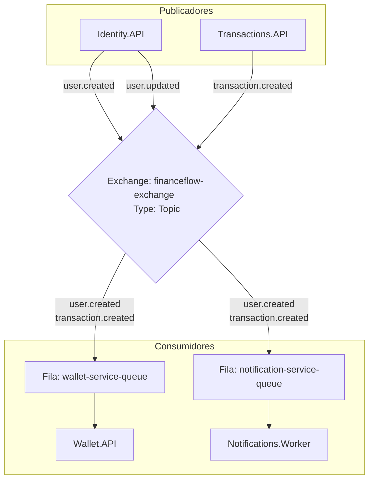

# FinanceFlow 🪙

FinanceFlow é um ecossistema moderno de gerenciamento financeiro pessoal e controle de carteira estruturado sob uma arquitetura de microsserviços resiliente, utilizando **.NET 9 / ASP.NET Core**, **React (Vite + Tailwind CSS)** no front-end, **RabbitMQ** como message broker para comunicação assíncrona, e **PostgreSQL** para persistência de dados.

---

## 🏛️ Arquitetura do Sistema

O sistema é dividido nos seguintes componentes:

1. **Web (Front-end):** Aplicação React moderna com visual *premium* (glassmorphism), construída utilizando Vite, Tailwind CSS e Framer Motion. Apresenta dashboards interativos com gráficos e fluxos fluidos de modais.
2. **Gateway (YARP Proxy):** Proxy reverso central que atua como porta de entrada única para o ecossistema, roteando as requisições HTTP do front-end para os respectivos microsserviços de forma transparente.
3. **Identity.API:** Serviço responsável pela autenticação, registro de usuários e emissão de tokens JWT.
4. **Wallet.API:** Microsserviço que gerencia as contas bancárias (instituições financeiras), saldos iniciais e a consolidação do patrimônio líquido do usuário.
5. **Transactions.API:** Serviço focado no registro de movimentações financeiras (receitas e despesas).
6. **Notifications.Worker:** Worker em background focado em processar eventos de notificação (como e-mails de boas-vindas ou alertas de novas transações).
7. **SharedKernel (FinanceFlow.SharedKernel):** Biblioteca compartilhada contendo contratos de mensagens, utilitários, tratamento de constantes de comunicação e infraestrutura base de RabbitMQ.

---

## ✉️ Comunicação Assíncrona com RabbitMQ

Os microsserviços do FinanceFlow utilizam comunicação assíncrona baseada em eventos para manter a consistência eventual dos dados entre os serviços (Coreografia de Microservices) sem acoplamento temporal HTTP.

### Estrutura do Message Broker

* **Exchange Principal:** `financeflow-exchange` (do tipo **Topic**). 
  O tipo *Topic* permite que as mensagens sejam roteadas para diferentes filas com base em padrões de chaves de roteamento flexíveis (*Routing Keys*).
* **Idempotência de Declaração:** A classe base `BaseRabbitMqSubscriber` garante a declaração segura e idempotente do exchange na inicialização dos consumidores. Se o exchange já existir, o RabbitMQ reutiliza-o sem interrupções.

### Fluxo de Mensagens (Eventos)

O diagrama abaixo ilustra como as mensagens fluem através do sistema:



#### 1. Eventos Publicados (Publishers)
* **`user.created`**: Publicado pelo `Identity.API` quando um novo usuário realiza o cadastro com sucesso.
* **`user.updated`**: Publicado pelo `Identity.API` quando os dados cadastrais do perfil do usuário são atualizados.
* **`transaction.created`**: Publicado pelo `Transactions.API` toda vez que o usuário insere uma nova despesa ou receita no sistema.

#### 2. Filas e Consumidores (Consumers)

* **Fila `wallet-service-queue` (consumida pelo `Wallet.API`):**
  * **Interesse:** Escuta os eventos `user.created` e `transaction.created`.
  * **Ação no `user.created`:** Cria e inicializa a carteira básica padrão do novo usuário.
  * **Ação no `transaction.created`:** Atualiza automaticamente o saldo consolidado da conta bancária afetada pela transação (somando se for receita, subtraindo se for despesa).

* **Fila `notification-service-queue` (consumida pelo `Notifications.Worker`):**
  * **Interesse:** Escuta os eventos `user.created` e `transaction.created`.
  * **Ação no `user.created`:** Envia um e-mail de boas-vindas ao usuário recém-criado.
  * **Ação no `transaction.created`:** Envia notificações de alerta contendo os dados da movimentação recém-registrada.

---

## 🛠️ Resiliência na Conexão com o RabbitMQ

Para evitar perdas de mensagens causadas por instabilidades temporárias na rede ou reinicialização de containers, a infraestrutura compartilhada no `SharedKernel` conta com:

* **`IRabbitMqPersistentConnection`**: Gerencia tentativas de conexão automáticas utilizando políticas de retentativa resilientes antes de falhar.
* **Persistência de Mensagens**: As chaves e propriedades de publicação marcam as mensagens com o modo de entrega persistente (`DeliveryMode = Persistent`), garantindo que mensagens na fila sejam salvas no disco do broker RabbitMQ.
* **Conexões Seguras**: Utilização de canais assíncronos isolados (`CreateChannelAsync`) para cada subscriber em background do .NET (baseados em `BackgroundService` hospedados).

---

## 🚀 Como Executar o Projeto

O ecossistema inteiro pode ser facilmente executado utilizando Docker Compose:

### Pré-requisitos
* Docker instalado
* Docker Compose instalado

### Inicialização

1. Copie o arquivo `.env.example` para `.env` e configure suas variáveis de ambiente locais (como senhas do banco de dados e credenciais do broker):
   ```bash
   cp .env.example .env
   ```

2. Suba todos os microsserviços e infraestruturas do projeto com o comando:
   ```bash
   docker-compose up --build
   ```

### Portas e Serviços Locais

Após subir os containers, os seguintes serviços estarão disponíveis:

* **Web App (Frontend React):** [http://localhost:3000](http://localhost:3000)
* **API Gateway (YARP Entrypoint):** [http://localhost:5000](http://localhost:5000)
* **Painel do RabbitMQ (Management):** [http://localhost:15673](http://localhost:15673) (usuário: `guest`, senha: `guest`)
* **pgAdmin (Banco de Dados):** [http://localhost:5050](http://localhost:5050)
